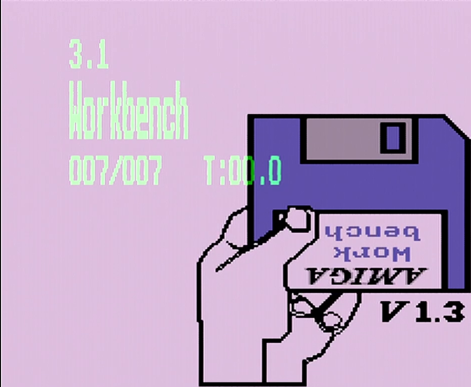
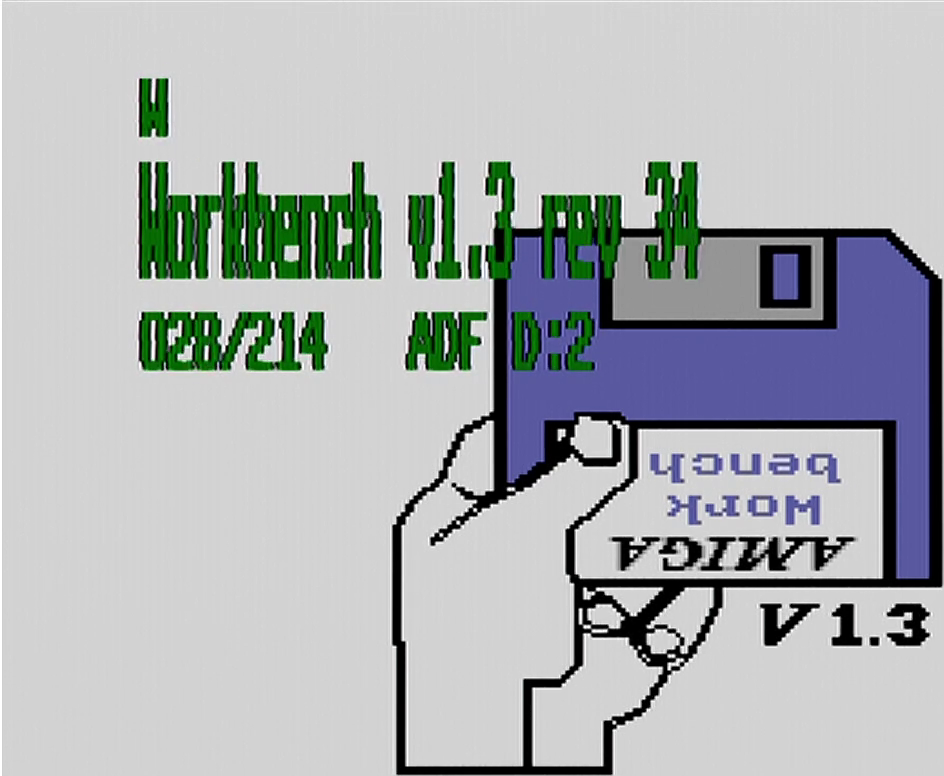
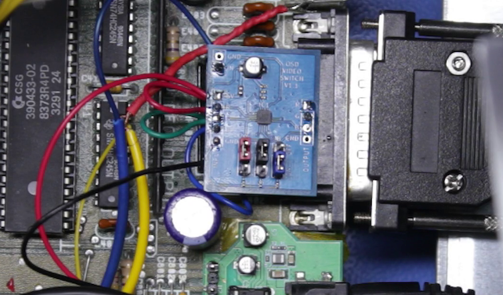

# OSDSwitch
FF-OSD Video Switcher for clean video output

This is a small board with a high bandwidth video switching chip
on it. The idea is that this sits in between the video generation 
circuitry and the video output socket of your Amiga (or similar
computer) and is controlled by the On Screen Display signal from
a modified Gotek (see [keirf/flashfloppy-osd](https://github.com/keirf/flashfloppy-osd).

Normally the output of the OSD mod is just blasted unceremoniously
over the green (or channel of your choice) signal, overpowering the
circuitry in the receiving display system to give a green tint where
the text is.

This is not great. It's crude, and doesn't always work right, and
the results are often less than desirable. 

This small board is the answer. It actively cuts out the normal
video signal when the OSD text should be displayed, and replaces that
video signal with a statically defined colour of your choice (configured
by 3 jumpers) to give a crystal clear OSD that is embedded within the
video stream, not overlayed on top of it.

I developed this board because I use an Extron video scaler connected
to my Amiga for both video capture while livestreaming and for display
on a modern TFT screen. But the traditional overlay setup really didn't
work with the Extron.  Everything went pink:

And so this board was born. The ADG1633BCPZ looked to be the ideal
chip, with more than enough bandwidth for a video signal (one of the
intended applications for this chip), and three channels, the board
was pretty simple to design. And I think you'll agree the results
are much nicer:

(This image is from before I tweaked the resistor values a little,
so the OSD is a bit darker than I would have liked).

Installation is reasonably simple. For the Amiga 500 (R6):

* Lift the side of the three ferrite beads by the video connector that is facing
  towards Denise (where you would normally solder the OSD wire to.
* Connect three wires to where they were soldered
* Attach the three wires to the INPUT side of the board's R G and B pins.
* Solder the ferrite beads you just lifted one side of to the output
  R G and B pins
* Connect a 5V and GND signal from somewhere suitable
* Connect the signal from your OSD generator to the IN pin.

Choose the colour you want with the jumpers (bonus hack: if you use resistors
instead of jumpers you can get a wider range of colours to choose from).

And here it is installed in my Amiga:

